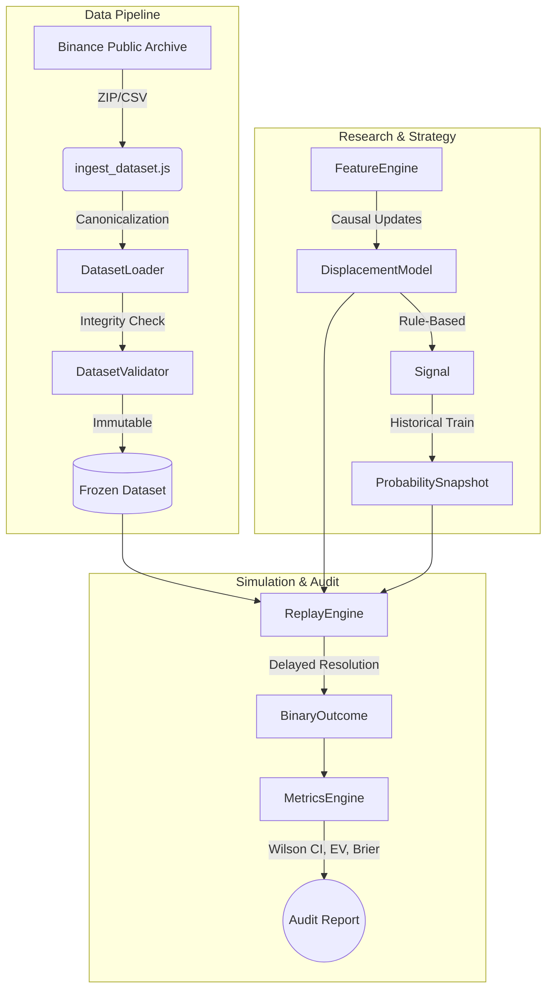

# Binary Options Quant Laboratory


Um sistema quantitativo institucional e deliberadamente estruturado para pesquisa, auditoria e backtesting de derivativos de opções binárias. 

Este repositório não é um "bot de trade". É um laboratório de evidências projetado para **provar a ausência ou presença de edge estatístico e econômico** sob condições extremas de rigor metodológico.

---

## 🏛️ Filosofia e Epistemologia (O Contrato Quantitativo)

O projeto opera sob um contrato estrito de integridade de dados e causalidade:

1. **Strict Causality (No Look-ahead):** O estado OOS (Out-of-Sample) é atualizado de forma estritamente sequencial. O timestamp $t+1$ nunca influencia a decisão em $t$.
2. **Barreira Econômica (Break-Even):** Para um payout de 0.80, a barreira não é 50%. A barreira é $P_{BE} = 55.56\%$. Qualquer modelo com *win rate* inferior a isso possui *Negative Expectancy (EV < 0)*, independentemente de p-values de edge direcional.
3. **Imutabilidade e Congelamento (FROZEN):** Hipóteses são pré-declaradas em formato MD e **congeladas** em controle de versão antes de qualquer dado OOS ser consumido. É proibido o *post-hoc tuning* (ajuste de hiperparâmetros após ver o resultado).
4. **Wilson Score Interval:** O motor de métricas utiliza o intervalo de confiança de Wilson (95%) em vez de Wald para lidar de maneira robusta com proporções extremas e amostras pequenas. A amostra mínima ($N_{min}$) para qualquer declaração estatística é 30.

---

## 🏗️ Arquitetura do Sistema

O laboratório é dividido em pipelines independentes, garantindo que o carregamento de dados não contamine a modelagem, e que o motor de replay opere de forma agnóstica.



---

## 📂 Estrutura de Diretórios

```text
.
├── .agents/                 # Memória e metadados de orquestração de IA
├── research/
│   ├── datasets/            # Datasets canônicos e manifestos com hashes SHA-256
│   ├── hypotheses/          # Hipóteses pré-declaradas e congeladas (ex: HYPOTHESIS_001.md)
│   └── reports/             # Relatórios JSON de OOS Walk-Forward
├── scripts/                 # Scripts de ingestão, replay e baseline OOS
├── src/
│   ├── core/                # Primitivas imutáveis (Signal, MarketObservation, BinaryOutcome)
│   ├── data/                # Validadores estruturais e loaders estritos
│   ├── replay/              # Motor causal de replay (Delayed Resolution)
│   ├── research/            # Motores de calibração, métricas e baselines
│   ├── strategy/            # Feature Engine e Classificadores
│   └── validation/          # Walk-Forward rolling validators
└── tests/                   # 100+ testes unitários e adversariais
```

---

## 🔬 Estado Atual (Commit 008)

O projeto está atualmente na fase **008 (Strategy Hypothesis)**. 
A infraestrutura principal está 100% testada e congelada.

- **006B:** Baseline Real Market (BTCUSDT Jan/24) executado. Edge não detectado (50.43%). **[FROZEN]**
- **007:** Validação Adversarial e de Robustez (100 testes passando). **[FROZEN]**
- **008.1:** `DATASET_002` (Fev-Mai 2024, 174.240 linhas, zero gaps) ingerido. **[FROZEN]**
- **008.2:** `HYPOTHESIS_001` (Short-Horizon Momentum/Displacement) pré-declarada. **[FROZEN]**
- **Em desenvolvimento:** Implementação do `FeatureEngine` causal e `DisplacementModel` baseados na probabilidade condicional histórica.

*(Veja o arquivo `STATE.md` para um detalhamento de todas as fases do projeto).*

---

## 🚀 Getting Started

### Pré-requisitos
- Node.js (v18+)
- Git

### Instalação
```bash
git clone https://github.com/SEU_USUARIO/binary-options-quant.git
cd binary-options-quant
npm install
```

### Rodando a Suíte de Auditoria (Testes Adversariais)
Para garantir a sanidade da matemática e da causalidade do seu ambiente local:
```bash
npx jest
```
*(Todos os 100 testes divididos em integridade, controle negativo, calibração matemática e estresse temporal devem passar).*

---

## ⚖️ Licença e Aviso Legal

Distribuído sob a licença MIT. 

**Este software destina-se estritamente à pesquisa quantitativa.** Nenhuma parte deste repositório constitui conselho financeiro ou recomendação de investimento. Os resultados obtidos em backtests passados não são garantia de desempenho futuro, especialmente em mercados de opções binárias que possuem esperança matemática intrinsecamente negativa devido à fricção do *payout*.
